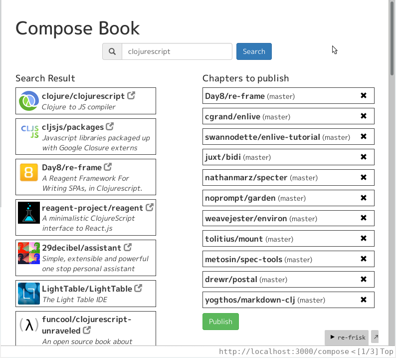

# Kurorin

Kurorin is a web application relating to GitHub and Kindle. It's main purpose is my learning:

- Clojure
- ClojureScript
- boot
- re-frame
- Datomic

Besides that, Kurorin actually is a practical tool; it collects any top-page (aka README) on GitHub repositories and composes them into a Kindle mobi file. Because some of them are really good readings, you know.

# TODO (or just an idea)

- Search users (and mix with repo search)
- Paging search result
- Async publishing
- Cache contents
- Download mobi files
- Save to/load from Datomic
- Go out of readmes
- Go out of GitHub
- Manage books
- More config
- Better UI
- Better jacket
- Search history
- Undo/redo for composing

# Configuration

    ;; app-config.edn
    {:github-credential
     ["gpsoft"                   ; user name
      "aaa000bbb000ccc000"]}     ; password or personal access token

# Developing

    $ boot dev

And browse `http://localhost:3000`.

# Release

    $ boot release
    $ java -Dconf=app-config.edn -jar release/kurorin.jar

And browse `http://localhost:3333`.

# Using Docker (and make command)

Build a docker image named "kurorin" (which is based on alpine and kindlegen ready).

    $ boot release
    $ cd docker
    $ make image          ...build an image for serving Kurorin

And serve Kurorin.

    $ make serve          ...run container and serve Kurorin
                             forwarding port 3333
                             volume sharing local dir ./docker/books
                             *** You should change makefile to use other dir
                             *** with which docker can share.

For plumbing.

    $ make shell          ...run container
    $ make attach         ...attach to the running server

# Screenshot

